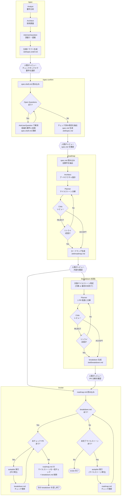

# belt

Claude Code 用の最小構成オートパイロットプラグイン。

専用エージェントによる分析・設計・実装・QA・レビューを自動で実行します。

## インストール

```claude
/plugin marketplace add HMasataka/belt
/plugin install belt@HMasataka-belt
```

## 使い方

### 単一タスク

```claude
/belt:autopilot <タスクの内容>
```

### 壁打ち・ブレスト

```claude
/belt:brainstorm このプロジェクトの名前を考えて
```

### 大規模プロジェクト

段階的に要件定義からロードマップ作成、実装まで進めるワークフローです。
各ステップの間で人間がレビュー・取捨選択できます。

```claude
/belt:spec <プロジェクトの説明>    # 仕様ドラフトを生成 → .belt/spec.draft.md
# spec.draft.md のチェックボックスで採用する要件を選択
/belt:spec-confirm                 # チェック済み要件のみを抽出 → .belt/spec.md
# spec.md の内容を確認
/belt:roadmap                      # ロードマップを生成 → .belt/roadmap.md
# roadmap.md の内容を確認
/belt:breakdown [v0.X]             # （任意）1マイルストーンを 1 PR 粒度に分解 → .belt/breakdown.md
# breakdown.md の内容を確認
/belt:cruise                       # breakdown.md があれば PR 単位、無ければマイルストーン単位で autopilot 実行
```

`/belt:breakdown` は省略可能で、ロードマップのマイルストーンをそのまま autopilot に渡したい場合は不要です。マイルストーンが大きすぎる場合に挟むと、1 PR で提出して違和感がない粒度に細分化されます。

## スキル一覧

| スキル      | 説明                                                                 |
| ----------- | -------------------------------------------------------------------- |
| `autopilot` | 分析・設計・計画・実装・QA・レビューの6フェーズを一括実行            |
| `spec`      | 要件分析を行い、チェックボックス付き仕様ドラフトを `.belt/spec.draft.md` に出力 |
| `spec-confirm` | `spec.draft.md` のチェック済み要件のみを `.belt/spec.md` に出力 |
| `roadmap`   | `spec.md` からマイルストーン付きロードマップを生成 |
| `breakdown` | `roadmap.md` の1マイルストーンを 1 PR 粒度に分解し `.belt/breakdown.md` に出力 |
| `cruise`    | `breakdown.md` があれば PR 単位、無ければマイルストーン単位で autopilot を実行するループ |
| `brainstorm`| アイデアを大量に発散させる壁打ち相手。名前決め・機能案など何でも     |

## エージェント一覧

| エージェント        | モデル | 説明                                                           |
| ------------------- | ------ | -------------------------------------------------------------- |
| `analyst`           | opus   | 計画前の要件分析コンサルタント                                 |
| `architect`         | opus   | 戦略的アーキテクチャ分析・デバッグアドバイザー                 |
| `planner`           | opus   | 構造化されたヒアリングを通じて実行可能な計画を作成する         |
| `critic`            | opus   | 計画・コードの品質ゲート。徹底的・構造的・多角的レビュー       |
| `executor`          | sonnet | タスク実装の専門家。計画に基づきコード変更を正確に実行する     |
| `test-engineer`     | sonnet | テスト戦略設計、テスト作成、フレーキーテスト対策               |
| `debugger`          | sonnet | 根本原因分析、リグレッション分離、ビルドエラー解決             |
| `reviewer`          | sonnet | コード品質の体系的レビュー。深刻度付きフィードバック           |
| `security-reviewer` | opus   | セキュリティ脆弱性検出。OWASP Top 10、秘密情報、危険なパターン |
| `scout`             | haiku  | コードベースの高速偵察・情報収集。後続エージェントの材料を準備 |

## 仕組み

### autopilot

6フェーズのワークフローを実行します。

1. **要件分析** — Analyst (opus) がギャップ・ガードレール・エッジケースを分析
1. **設計・計画** — Architect → Planner (opus) が実装計画を作成
1. **計画レビュー** — Critic (opus) が計画を評価、REJECT 時は最大3回リトライ
1. **実装** — Executor がグループ単位で並列実行 (complexity: high は opus、normal は sonnet)
1. **QA** — Test Engineer + ビルド・テスト検証、失敗時は Debugger で最大2回リトライ
1. **レビュー** — Reviewer + Security Reviewer (sonnet) が品質・セキュリティをチェック

QA が2回失敗すると Architect が根本原因を診断し Phase 1 からやり直します（全体リトライ最大2回）。


### spec → spec-confirm → roadmap → (breakdown) → cruise

大規模タスクを段階的に進めるワークフローです。
各スキルの間に人間のレビューポイントがあります。

1. **spec** — Analyst と Architect が要件を分析、AskUserQuestion で深掘り、チェックボックス付き仕様ドラフトを `.belt/spec.draft.md` に出力
1. **人間のレビュー** — spec.draft.md のチェックボックスで採用する要件を選択
1. **spec-confirm** — spec.draft.md に残る Open Questions を AskUserQuestion で解消して要件に反映したうえで、チェック済み要件のみを抽出し、チェックボックスなしの仕様ドキュメントを `.belt/spec.md` に出力
1. **人間のレビュー** — spec.md の内容を確認
1. **roadmap** — spec.md の全要件から Architect が設計、Planner がマイルストーンに分解、Critic がレビュー、`.belt/roadmap.md` に出力
1. **人間のレビュー** — roadmap.md の内容を確認
1. **breakdown（任意）** — 指定マイルストーン（省略時は最初の未完了マイルストーン）を Planner+Critic で 1 PR 粒度に分解し、`.belt/breakdown.md` に出力。JIT 方式で 1 マイルストーンずつ実行する
1. **人間のレビュー** — breakdown.md の内容を確認
1. **cruise** — `breakdown.md` があれば PR 単位で autopilot を実行（完了で breakdown.md のチェック更新、全 PR 完了で roadmap.md のマイルストーンを一括チェック）、無ければマイルストーン単位で autopilot を順次実行。中断後も `/belt:cruise` で再開可能



MCP サーバーで状態を永続化するため、中断したワークフローを再開できます。

## アンインストール

```claude
/plugin uninstall belt@HMasataka-belt
/plugin marketplace remove HMasataka-belt
```
