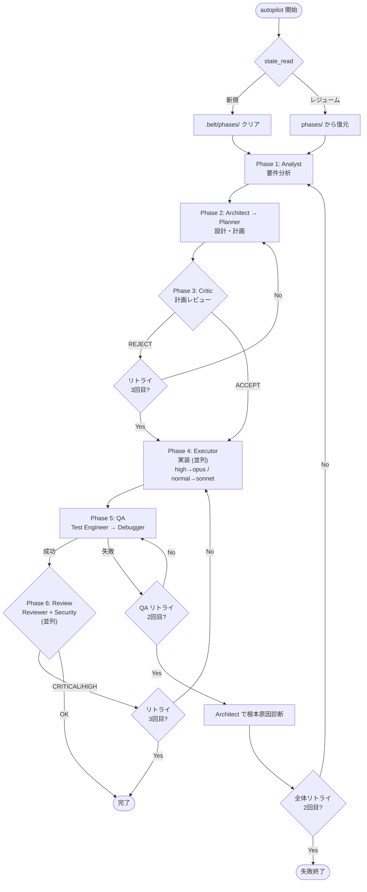
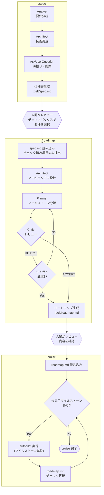

# belt

Claude Code 用の最小構成オートパイロットプラグイン。

専用エージェントによる分析・設計・実装・QA・レビューを自動で実行します。

## インストール

```claude
/plugin marketplace add HMasataka/belt
/plugin install belt@HMasataka-belt
```

## 使い方

### 単一タスク

```claude
/belt:autopilot <タスクの内容>
```

### 大規模プロジェクト

段階的に要件定義からロードマップ作成、実装まで進めるワークフローです。
各ステップの間で人間がレビュー・取捨選択できます。

```claude
/belt:spec <プロジェクトの説明>    # 仕様書を生成 → .belt/spec.md
# spec.md のチェックボックスで採用する要件を選択
/belt:roadmap                      # ロードマップを生成 → .belt/roadmap.md
# roadmap.md の内容を確認
/belt:cruise                       # マイルストーン順に autopilot で実装
```

## スキル一覧

| スキル      | 説明                                                                 |
| ----------- | -------------------------------------------------------------------- |
| `autopilot` | 分析・設計・計画・実装・QA・レビューの6フェーズを一括実行            |
| `spec`      | 要件分析を行い、チェックボックス付き仕様書を `.belt/spec.md` に出力  |
| `roadmap`   | `spec.md` のチェック済み要件からマイルストーン付きロードマップを生成 |
| `cruise`    | `roadmap.md` のマイルストーンを順に autopilot で実行するループ       |

## 仕組み

### autopilot

6フェーズのワークフローを実行します。

1. **要件分析** — Analyst (opus) がギャップ・ガードレール・エッジケースを分析
1. **設計・計画** — Architect → Planner (opus) が実装計画を作成
1. **計画レビュー** — Critic (opus) が計画を評価、REJECT 時は最大3回リトライ
1. **実装** — Executor がグループ単位で並列実行 (complexity: high は opus、normal は sonnet)
1. **QA** — Test Engineer + ビルド・テスト検証、失敗時は Debugger で最大2回リトライ
1. **レビュー** — Reviewer + Security Reviewer (sonnet) が品質・セキュリティをチェック

QA が2回失敗すると Architect が根本原因を診断し Phase 1 からやり直します（全体リトライ最大2回）。



### spec → roadmap → cruise

大規模タスクを段階的に進めるワークフローです。
各スキルの間に人間のレビューポイントがあります。

1. **spec** — Analyst と Architect が要件を分析、AskUserQuestion で深掘り、チェックボックス付き仕様書を `.belt/spec.md` に出力
1. **人間のレビュー** — spec.md のチェックボックスで採用する要件を選択
1. **roadmap** — チェック済み要件から Architect が設計、Planner がマイルストーンに分解、Critic がレビュー、`.belt/roadmap.md` に出力
1. **人間のレビュー** — roadmap.md の内容を確認
1. **cruise** — 各マイルストーンを autopilot で順次実行し、完了タスクのチェックボックスを更新。中断後も `/cruise` で再開可能



MCP サーバーで状態を永続化するため、中断したワークフローを再開できます。

## アンインストール

```claude
/plugin uninstall belt@HMasataka-belt
/plugin marketplace remove HMasataka-belt
```
